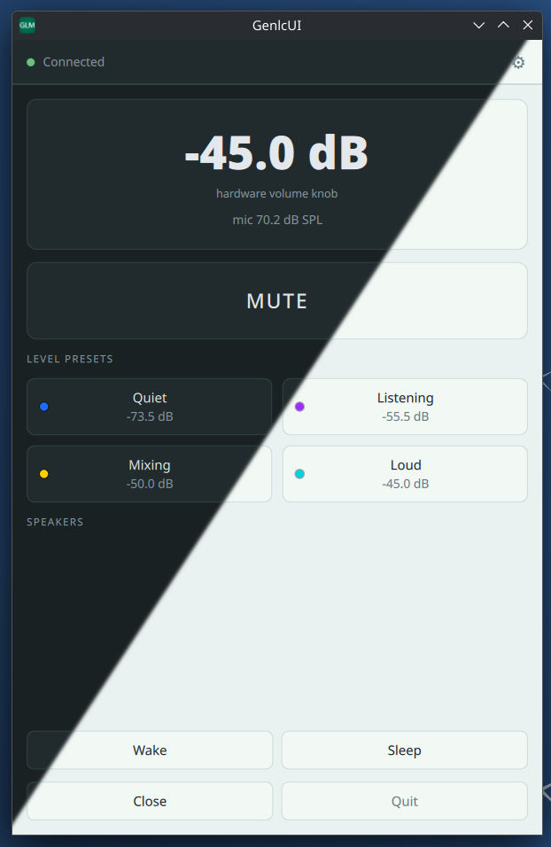
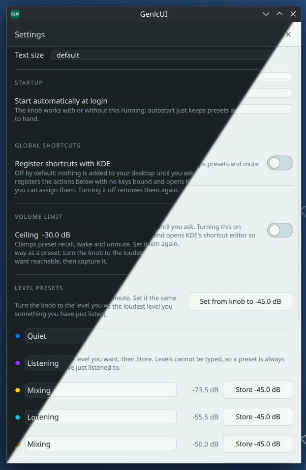

# GenlcUI

A Linux desktop controller for Genelec SAM monitor control, driving the GLM network
adapter directly over USB HID. Built for KDE Plasma on Wayland. Tested on Debian 13.

[Genelec](https://www.genelec.com/) ships [GLM](https://www.genelec.com/glm) for Windows and macOS but not Linux. This project fills that gap for
day-to-day control such as levels, presets, wake/sleep, live status. It is **not** a
calibration tool and never writes to speaker flash, so a calibration made with
GLM5 stays exactly as you left it.

## Features

- **Level presets** — four level presets, can be (re)named and recalled with a click, from the tray, or from the global KDE keyboard shortcut
- **Mute**, wake and sleep (sleep can be defeated by speaker auto-awake ISS)
- **Live status** — knob position, microphone SPL, per-speaker temperature
- **Tray icon that shows state** by colour
- **Speaker naming and identify** — light a speaker's LED to see which is which
- **Themes** — light/dark/system, ten accent colours, seven text sizes
- **Autostart**, and a configurable volume ceiling

## Design: the knob is master

GenlcUI follows GLM's own model:

- **No software fader and no typed levels.** A mouse slip could be a hearing hazard.
- **The hardware volume knob is the master.** The UI displays the level.
- **Presets and mute are one exclusive group.** Nothing selected means the
  knob is in charge; touching the knob cancels any override.
- **Presets are captured from the knob**, never typed, so a stored level is
  by construction one you have just listened to.
- **A configurable ceiling** (default -30 dBFS) clamps programmatic writes to protect your hearing.

See [docs/DESIGN.md](docs/DESIGN.md) for the reasoning.

## Safety

Genelec documents that SAM monitors start at **maximum level** in standalone
mode, so anything that wakes a speaker is a hearing risk if handled naively.
GenlcUI therefore holds the level at -120 dBFS across the whole wake window,
re-asserting it while monitors boot, and brings any newly discovered speaker
to the current level before it can be heard.

## Install

### Debian / Ubuntu (recommended)

Download the `.deb` from
[Releases](https://github.com/AtmanActive/GenlcUI/releases) and:

    sudo apt install ./genlcui_*.deb

This is the only option that installs the udev rule for you, so the adapter
works without any further setup. Qt is bundled, so it does not depend on your
distribution's Qt version.

### AppImage

    chmod +x GenlcUI-*.AppImage
    ./GenlcUI-*.AppImage

Self-contained and needs no root — but for that reason it *cannot* install the
udev rule. On first run GenlcUI will detect that the adapter is present but
unreadable and show you the exact command to fix it.

### Tarball

    tar xf genlcui-*-linux-x86_64.tar.gz
    cd genlcui-*
    ./install.sh          # installs into ~/.local, no root

### From source

    uv venv && uv pip install -e .
    ./packaging/install-icons.sh
    sudo install -m 0644 packaging/udev/70-genelec-glm.rules /etc/udev/rules.d/
    sudo udevadm control --reload-rules && sudo udevadm trigger
    genlcui

## Device permissions

The GLM adapter appears as a raw HID device, which Linux restricts to root by
default. Only the `.deb` installs the rule automatically; for every other
format GenlcUI detects the situation and shows a dialog with the exact
copy-pasteable commands.

## Building packages

    ./packaging/build-all.sh

Produces a `.deb`, an AppImage and a tarball in `dist/`. Everything is built
from one bundle containing its own CPython and a pruned PySide6 (650 MB of Qt
reduced to ~208 MB by dropping WebEngine, Quick3D, Multimedia and friends).
`verify-bundle.sh` runs against the pruned tree before anything is packaged,
because a missing Qt library is a crash in a shipped binary rather than a test
failure. The AppImage step additionally needs `appimagetool` on PATH.

### Releases

Releases are cut by hand from the **Build and draft release** workflow under
the repository's Actions tab. It runs the test suite, builds all three
artefacts, checks none are missing, and opens a **draft** release with
checksums — publishing it stays a manual decision. The tag defaults to
`v<version from genlcui/__init__.py>`.

## Protocol

The GLM protocol is proprietary and undocumented.
[docs/PROTOCOL.md](docs/PROTOCOL.md) records what has been established by live
capture, including several places where the earlier
[genlc](https://github.com/markbergsma/genlc) project's model is wrong in ways
that break working systems — most notably that its `bypass(led_color=...)`
API does not set an LED colour and will disable your volume control.

Other findings worth knowing if you are writing your own controller:

- Monitor poll responses are **tag-value encoded**, not fixed-offset.
- Address assignments are **leases** that expire after ~2–3s of bus silence.
- Holding the bus **disables the user's volume knob** unless you mirror it.
- `STAY_ONLINE` will **wake speakers you just put to sleep**.

## Relationship to genlc

This project began from [markbergsma/genlc](https://github.com/markbergsma/genlc)
(GPLv3), vendored under `genlc/` for reference and attribution. GenlcUI's own
protocol implementation in `genlcui/core/` is a rewrite: upstream's poll parser
uses fixed offsets where the wire format is tag-value encoded, and it does not
read the adapter's volume field at all.

GenlcUI is GPLv3 in consequence.

## Development

    .venv/bin/python -m pytest        # 291 tests, no hardware needed

The core (`genlcui/core/`) imports no Qt and is usable from a plain script.
Diagnostic scripts under `scripts/` talk to real hardware; each says at the
top whether it writes anything.

Developed by AtmanActive while standing on the shoulder of giants: [markbergsma](https://github.com/markbergsma) and [Antrophic](https://www.anthropic.com/).

